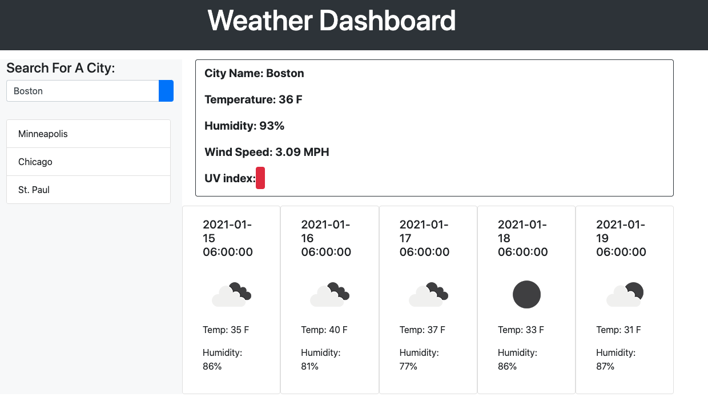

# Weather-Dashboard

This weather dashboard allows users to type in a city of their choice and see current and future conditions. The city they search for is then added to the search history and is stored in the local storage. This dashboard pulls data from various OpenWeather API's.

<strong>Repo Link:</strong> https://github.com/amay1421/Weather-Dashboard
 
<strong>Deployed Link:</strong>